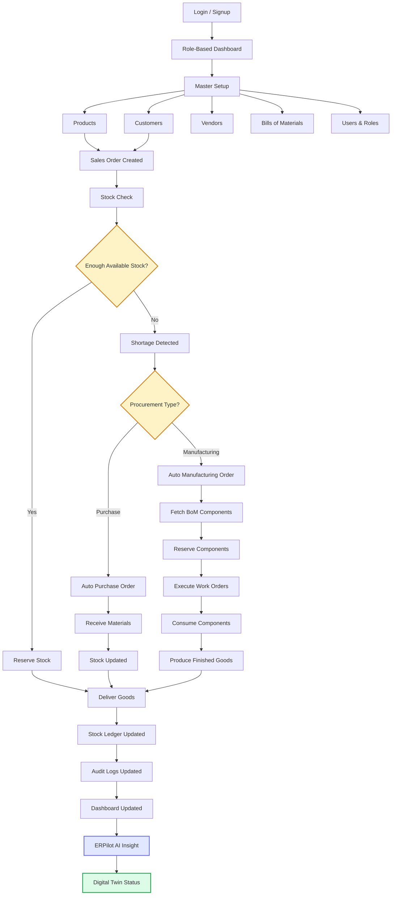
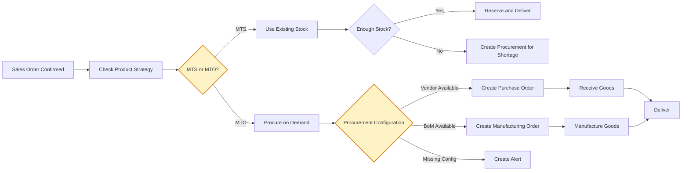
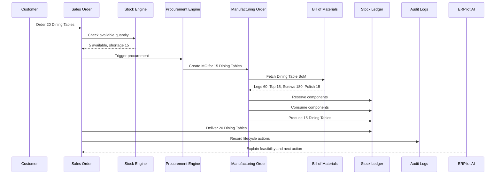
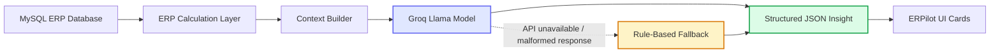
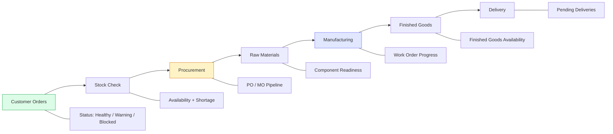
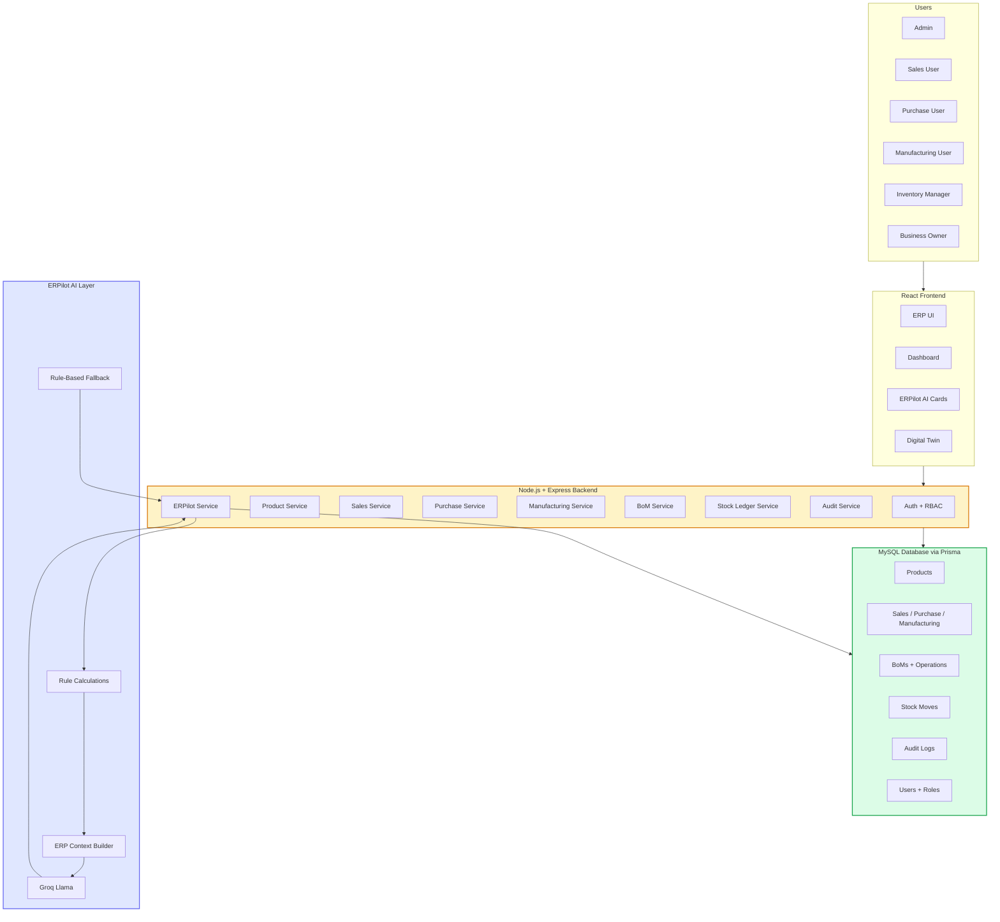
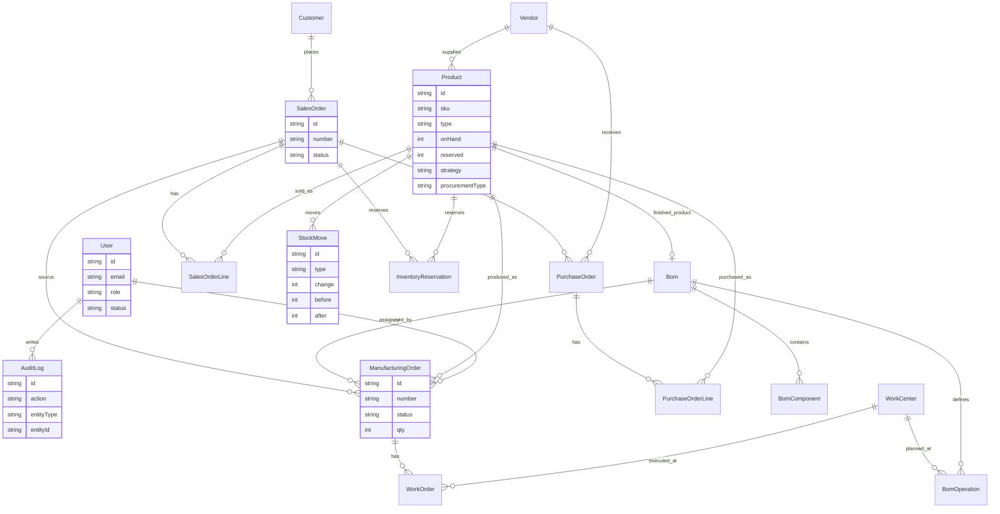
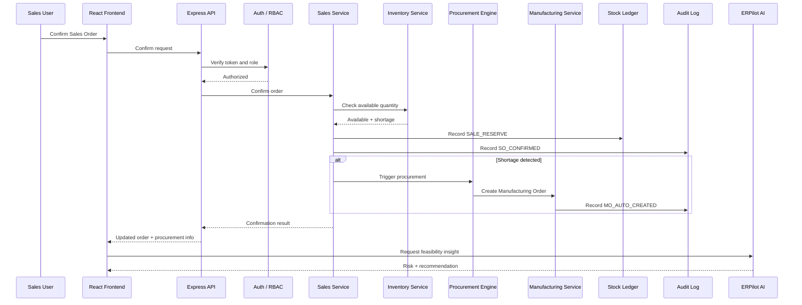

<div align="center">

# FlowForge ERP + ERPilot AI

### **From demand to delivery - every stock movement explained.**


</div>


---
## Team

| Team | Members |
| --- | --- |
| LogicForge | Sanket Prajapati, Manav Joshi |

Built for the Odoo x Parul University Hackathon 2026.

---

FlowForge ERP is a full-stack Mini ERP platform for furniture manufacturing businesses. It connects Sales, Purchase, Manufacturing, Bills of Materials, Inventory, Procurement, Stock Ledger, Audit Logs, Role-Based Access, Dashboard visibility, Digital Twin, and ERPilot AI into one complete demand-to-delivery workflow.

> **FlowForge ERP is the transaction engine. ERPilot AI is the decision engine.**

## Product Snapshot

| Area | What FlowForge ERP Delivers |
| --- | --- |
| Products | Finished goods, raw materials, SKU, pricing, stock and procurement configuration |
| Customers | Customer master data connected to sales order demand |
| Vendors | Supplier profiles, lead time, reliability, cost and supplies |
| Sales | Demand capture, confirmation, reservation, delivery and cancellation |
| Purchase | Purchase order lifecycle, vendor receipt and stock increase |
| Manufacturing | BoM-based production with work orders and finished goods output |
| BoM | Component and operation definitions per finished product |
| Inventory | On-hand, reserved and available stock visibility |
| Procurement Automation | MTS/MTO decision path for shortage handling |
| Stock Ledger | Every stock movement recorded with before/after quantity |
| Audit Logs | Business traceability across key actions and field changes |
| Access Rights | Admin and role-based module permissions |
| Dashboard | Live status counters, risk indicators and next actions |
| ERPilot AI | Business explanations, recommendations and simulations |
| Digital Twin | Visual demand-to-delivery pipeline status |
| Alerts | Low stock, shortage, overdue and bottleneck signals |

## Problem Statement

Shiv Furniture Works needs more than isolated records. Furniture manufacturing involves customer demand, raw materials, BoMs, work centers, supplier timelines, production status, delivery commitments and stock accountability.

Many small and medium manufacturers still depend on disconnected spreadsheets, manual stock registers, paper BoMs, delayed procurement follow-up and manual manufacturing coordination. This creates overselling, understocking, late deliveries, unclear ownership, difficult traceability and weak owner-level visibility.

The real challenge is not only storing records. The real challenge is connecting every business action to inventory movement, traceability, and decision support.

## Solution Overview

FlowForge ERP converts manual operations into connected demand-to-delivery orchestration:

```text
Product + BoM -> Sales Order -> Stock Check -> MTS/MTO Decision -> Procurement
-> Purchase / Manufacturing -> Stock Ledger -> Delivery -> Audit Logs
-> ERPilot AI Explanation
```

This is not CRUD. This is demand-to-delivery orchestration.

## Why This Is Not Just CRUD

CRUD only creates and displays records. FlowForge ERP connects records through business rules.

| CRUD System | FlowForge ERP |
| --- | --- |
| Stores products | Tracks on-hand, reserved, available stock |
| Stores sales orders | Confirms orders, checks stock, reserves quantity |
| Stores purchase orders | Receives goods and increases stock |
| Stores manufacturing orders | Consumes components and produces finished goods |
| Stores logs | Tracks full stock and audit traceability |
| Shows dashboard | Shows live operational health and AI recommendations |

## Core ERP Concept: Inventory Movement

Inventory movement is the center of the system. Sales, purchase, manufacturing, cancellation and adjustment workflows all create stock impact and traceability.

| Module | Stock Impact | Ledger Movement |
| --- | --- | --- |
| Sales | Reserve stock and deliver product | SALE_RESERVE, SALE_DELIVERY |
| Purchase | Receive products | PURCHASE_RECEIPT |
| Manufacturing | Reserve components, consume components, produce finished goods | MO_COMPONENT_RESERVE, MO_COMPONENT_CONSUME, MO_FINISHED_PRODUCE |
| Cancellation | Release reservation | RESERVATION_RELEASE, SALE_UNRESERVE |
| Adjustment | Manual correction | ADJUSTMENT, STOCK_ADJUSTMENT_IN, STOCK_ADJUSTMENT_OUT |

```text
Available Quantity = On Hand Quantity - Reserved Quantity
```

This formula is used internally for stock check and procurement decision. The UI displays available quantity directly without exposing unnecessary calculation text.

## Complete Demand-to-Delivery Workflow



## MTS vs MTO Logic

MTS means Make To Stock. MTO means Make To Order.

* Wooden Chair: MTS, on-hand 100, order 10, deliver from stock.
* Dining Table: MTO, on-hand 5, order 20, shortage 15, create Manufacturing Order.



## End-to-End Dining Table Example

| Field | Value |
| --- | --- |
| Customer | Raj Furniture Mart |
| Sales Order | 20 Dining Tables |
| Available stock | 5 |
| Shortage | 15 |
| Procurement type | Manufacturing |
| Auto-created record | Manufacturing Order for 15 Dining Tables |

BoM calculation:

* Wooden Legs: 15 x 4 = 60
* Wooden Top: 15 x 1 = 15
* Screws: 15 x 12 = 180
* Wood Polish: 15 x 1 = 15

Workflow:

1. Customer places Sales Order.
2. System checks stock.
3. Shortage detected.
4. Manufacturing Order is auto-created.
5. BoM components and work orders are populated.
6. Components are reserved.
7. Manufacturing work orders execute.
8. Components are consumed.
9. 15 Dining Tables are produced.
10. Sales Order is delivered.
11. Stock Ledger records all movements.
12. Audit Logs record all actions.
13. ERPilot AI explains the decision and next action.



## Core Modules

| Module | What It Does | Key Business Value |
| --- | --- | --- |
| Products | Maintains finished goods and components | Accurate stock and procurement setup |
| Customers | Stores customer data | Demand ownership and sales traceability |
| Vendors | Stores supplier data | Lead time and sourcing decisions |
| BoM | Defines components and operations | Manufacturing readiness |
| Sales Orders | Captures demand and delivery lifecycle | Stock reservation and fulfilment |
| Purchase Orders | Procures components and materials | Reliable replenishment |
| Manufacturing Orders | Produces finished goods from components | MTO/MTS production control |
| Work Orders | Tracks operation-level production tasks | Shop-floor progress visibility |
| Stock Ledger | Records every stock movement | Inventory proof |
| Audit Logs | Records business actions | Accountability |
| Users & Roles | Controls module access | Secure operations |
| Alerts | Highlights operational risks | Faster response |
| Dashboard | Summarizes live operations | Owner-level visibility |
| ERPilot AI | Explains and recommends actions | Decision support |
| Digital Twin | Visualizes live workflow state | Pipeline clarity |
| Supply Chain Map | Shows vendor and plant network | Location-aware supply visibility |

## Product and Procurement Configuration

Products include:

* SKU
* Product name
* Type: Finished / Component
* Sales Price
* Cost Price
* On Hand Qty
* Reserved Qty
* Available Qty
* Reorder Level
* Procure on Demand
* Procurement Type: Purchase / Manufacturing
* Vendor
* BoM
* Active Status

Business rules:

* Purchase procurement requires vendor configuration.
* Manufacturing procurement requires BoM configuration.
* Sales price fills sales order line pricing.
* Cost price fills purchase order line pricing.
* Product price and quantity changes create audit logs.
* Stock adjustments create stock ledger entries.

## Sales Order Lifecycle

```text
Draft -> Confirmed -> Partially Delivered -> Fully Delivered
Draft -> Cancelled
```

Key actions:

* Confirm: checks stock, reserves available quantity and triggers procurement if shortage exists.
* Deliver: decreases stock and updates delivered quantity.
* Cancel: cancels order and releases active reservation.
* Logs: records lifecycle actions.

## Purchase Order Lifecycle

```text
Draft -> Confirmed -> Partially Received -> Fully Received
Draft -> Cancelled
```

Key actions:

* Confirm: marks purchase as committed.
* Receive: increases stock through purchase receipt movement.
* Cancel: closes open purchase request.
* Logs: records purchase status changes and receipts.

## Manufacturing Order Lifecycle

```text
Draft -> Confirmed -> In Progress -> Done
Draft / Confirmed -> Cancelled
```

Key actions:

* Confirm: validates manufacturing intent.
* Start: reserves components and moves order into progress.
* Produce: consumes components and adds finished goods.
* Cancel: stops open manufacturing flow.
* Logs: records production actions and status changes.

## Bill of Materials Logic

Dining Table BoM:

| Component | Per Unit | For 15 Units |
| --- | ---: | ---: |
| Wooden Legs | 4 | 60 |
| Wooden Top | 1 | 15 |
| Screws | 12 | 180 |
| Wood Polish | 1 | 15 |

Operations:

| Operation | Work Center | Time |
| --- | --- | ---: |
| Assembly | Assembly Line | 60 mins |
| Painting | Paint Floor | 30 mins |
| Packing | Packaging Unit | 20 mins |

```text
Required Component Quantity = BoM Quantity Per Unit x Manufacturing Order Quantity
```

## Stock Ledger

Stock Ledger is the proof of inventory movement.

| Movement Type | Trigger | Stock Effect |
| --- | --- | --- |
| SALE_RESERVE | Sales order confirmation | Reserves available quantity |
| SALE_DELIVERY | Sales order delivery | Decreases finished goods |
| PURCHASE_RECEIPT | Purchase receipt | Increases purchased item |
| MO_COMPONENT_RESERVE | Manufacturing start | Reserves components |
| MO_COMPONENT_CONSUME | Manufacturing completion | Decreases components |
| MO_FINISHED_PRODUCE | Manufacturing completion | Increases finished goods |
| RESERVATION_RELEASE | Cancellation | Releases reserved quantity |
| ADJUSTMENT | Manual correction | Corrects stock |

Sample lifecycle ledger:

| Product | Movement | Qty | Reference |
| --- | --- | ---: | --- |
| Dining Table | SALE_RESERVE | -5 | SO-000001 |
| Wooden Legs | MO_COMPONENT_RESERVE | -60 | MO-000001 |
| Wooden Top | MO_COMPONENT_RESERVE | -15 | MO-000001 |
| Screws | MO_COMPONENT_RESERVE | -180 | MO-000001 |
| Wooden Legs | MO_COMPONENT_CONSUME | -60 | MO-000001 |
| Wooden Top | MO_COMPONENT_CONSUME | -15 | MO-000001 |
| Screws | MO_COMPONENT_CONSUME | -180 | MO-000001 |
| Dining Table | MO_FINISHED_PRODUCE | +15 | MO-000001 |
| Dining Table | SALE_DELIVERY | -20 | SO-000001 |

## Audit Logs

Audit logs are separate from stock ledger. Stock Ledger proves inventory movement. Audit Logs prove business action and user accountability.

Audit fields:

* Date and time
* User
* Module
* Record type
* Record ID
* Action
* Field changed
* Old value
* New value

Example actions:

* SO_CREATED
* SO_CONFIRMED
* MO_AUTO_CREATED
* MO_STARTED
* WO_COMPLETED
* MO_COMPLETED
* SALE_DELIVERY
* PO_CREATED
* PURCHASE_RECEIPT
* PRODUCT_PRICE_UPDATED
* USER_ROLE_CHANGED

## Role-Based Access Control

| Role | Main Access |
| --- | --- |
| Admin | Full workspace access, users and roles |
| Sales User | Customers, products, sales orders and sales-related visibility |
| Purchase User | Vendors, products, purchase orders and procurement signals |
| Manufacturing User | BoMs, manufacturing orders, work orders and production status |
| Inventory Manager | Products, inventory movement, stock ledger and stock adjustment |
| Business Owner | Dashboard, reports, intelligence views and business health |

Access is enforced in frontend navigation and backend APIs.

## Dashboard and Operational Visibility

The dashboard is designed for owner-level and operator-level visibility.

It includes:

* Business Health Score
* Sales Order counters
* Purchase Order counters
* Manufacturing Order counters
* Procurement Required
* Low Stock Products
* Material Shortages
* Stock Movements
* Audit Logs
* Alerts
* ERPilot AI Command Center
* Digital Twin Preview
* Next Best Actions

Dashboard data comes from MySQL through backend APIs.

## ERPilot AI Decision Layer

ERPilot AI reads live ERP data and converts it into operational insight. It never directly mutates stock or orders. The ERP core performs deterministic writes; ERPilot AI explains, predicts, simulates, and recommends.

Core AI features:

1. Real-Time ERP Chat Assistant
2. Order Feasibility Checker
3. Procurement and Reorder Recommendation
4. Manufacturing Readiness and Bottleneck Detection
5. What-If Simulator
6. Business Health Score
7. Root Cause, Stock Movement and Audit Explanation

The AI layer uses Groq API, Llama model integration, backend-only API key access and rule-based fallback behavior.

## ERPilot AI Architecture



The frontend never receives AI API keys. All AI calls are handled by backend services.

## ERPilot AI Features

| Feature | Business Value |
| --- | --- |
| Real-Time ERP Chat Assistant | Answers operational questions from live records |
| Order Feasibility Checker | Explains whether demand can be fulfilled |
| Procurement Recommendation | Highlights purchase/manufacturing needs |
| Manufacturing Readiness | Detects component and work-order blockers |
| What-If Simulator | Simulates large-order impact before commitment |
| Business Health Score | Summarizes operational condition |
| Root Cause Explanation | Explains delays, shortages and ledger movements |

## Digital Twin Workflow



## What-If Simulator

Example question: "What if we accept 500 Dining Tables?"

BoM impact:

* Wooden Legs: 500 x 4 = 2000
* Wooden Top: 500 x 1 = 500
* Screws: 500 x 12 = 6000
* Wood Polish: 500 x 1 = 500

The simulator checks live stock, BoM, vendor/procurement readiness, and manufacturing load before recommending whether to accept the order.

## Smart Vendor Recommendation

```text
Vendor Score = Reliability x 35% + Lead Time x 25% + Cost x 20% + Availability x 20%
```

The purchase user gets a ranked vendor recommendation before creating procurement.

## Root Cause Analysis

ERPilot AI can explain why an order is delayed:

* Component shortage
* Pending purchase receipt
* Manufacturing bottleneck
* Incomplete work order
* Delayed delivery
* Missing procurement configuration

## Alerts and Notifications

Alerts convert operational risk into action:

* Low stock
* Material shortage
* Procurement required
* Order delay risk
* Bottleneck risk
* Purchase overdue
* Work order blocked
* Delivery ready
* ERPilot recommendation

## System Architecture



## Database Design / ER Diagram



## API Overview

Actual API groups exposed by the Express app:

| Group | Base Path | Key Endpoints |
| --- | --- | --- |
| Health | `/api/health` | `GET /` |
| Auth | `/api/auth` | `POST /register`, `POST /login`, `GET /me` |
| Profile | `/api/profile` | `GET /`, `PUT /`, `POST /photo` |
| Products | `/api/products` | `GET /`, `POST /`, `GET /:id`, `PUT /:id`, `POST /:id/adjust-stock`, `DELETE /:id` |
| Customers | `/api/customers` | `GET /`, `POST /`, `GET /:id`, `PUT /:id`, `DELETE /:id` |
| Vendors | `/api/vendors` | `GET /`, `POST /`, `GET /:id`, `PUT /:id`, `DELETE /:id` |
| Manufacturing Plants | `/api/manufacturing-plants` | `GET /`, `POST /`, `GET /:id`, `PUT /:id`, `DELETE /:id` |
| BoM | `/api/boms` | `GET /`, `POST /`, `GET /:id`, `PUT /:id`, `DELETE /:id` |
| Sales Orders | `/api/sales-orders` | `GET /`, `POST /`, `GET /:id`, `PUT /:id`, `POST /:id/confirm`, `POST /:id/deliver`, `POST /:id/cancel` |
| Purchase Orders | `/api/purchase-orders` | `GET /`, `POST /`, `GET /:id`, `PUT /:id`, `POST /:id/confirm`, `POST /:id/receive`, `POST /:id/cancel` |
| Manufacturing Orders | `/api/manufacturing-orders` | `GET /`, `POST /`, `GET /:id`, `PUT /:id`, `POST /:id/confirm`, `POST /:id/start`, `POST /:id/complete`, `POST /:id/produce`, `POST /:id/cancel` |
| Stock Ledger | `/api/stock-moves` | `GET /`, `GET /summary`, `GET /map`, `GET /traceability`, `GET /exceptions`, `POST /adjustment`, `POST /internal-transfer` |
| Inventory Movement | `/api/inventory-movements` | Same stock movement router |
| Audit Logs | `/api/audit-logs` | `GET /`, `GET /summary`, `GET /record/:module/:recordId` |
| Dashboard | `/api/dashboard` | `GET /summary`, `GET /filter` |
| Alerts | `/api/alerts` | `GET /`, `POST /:id/read`, `PATCH /:id/read`, `POST /mark-all-read` |
| Users | `/api/users` | `GET /`, `POST /`, `GET /:id`, `PUT /:id`, `PATCH /:id/role`, `PATCH /:id/status`, `PATCH /:id/password`, `DELETE /:id` |
| ERPilot AI | `/api/erpilot` | `POST /chat`, `GET /business-health`, `GET /digital-twin`, `GET /reorder-recommendations`, `POST /what-if`, `POST /vendor-ranking`, `GET /bottlenecks` |
| AI Utility | `/api/ai` | `POST /procurement-advice`, `POST /business-health` |

## Request Lifecycle Diagram



## Dynamic MySQL Seed Data

The database includes realistic seed data to explore every module immediately:

* 6 users with roles
* Around 100 customers
* 10+ vendors
* 15+ products
* Finished goods and raw materials
* BoMs for finished goods
* Work centers and operations
* Sales orders across all statuses
* Purchase orders across all statuses
* Manufacturing orders across all statuses
* Stock ledger entries
* Audit logs
* Alerts

Seed users:

| Role | Email | Password |
| --- | --- | --- |
| Admin | [admin@flowforge.com](mailto:admin@flowforge.com) | Admin@123 |
| Sales User | [sales@flowforge.com](mailto:sales@flowforge.com) | Admin@123 |
| Purchase User | [purchase@flowforge.com](mailto:purchase@flowforge.com) | Admin@123 |
| Manufacturing User | [mfg@flowforge.com](mailto:mfg@flowforge.com) | Admin@123 |
| Inventory Manager | [inventory@flowforge.com](mailto:inventory@flowforge.com) | Admin@123 |
| Business Owner | [owner@flowforge.com](mailto:owner@flowforge.com) | Admin@123 |

## Security and Reliability

| Area | Implementation |
| --- | --- |
| JWT authentication | Token-based protected API access |
| Password security | bcrypt password hashing |
| RBAC | Role guard middleware protects module routes |
| Backend permission enforcement | API routes are protected with auth and role checks |
| Prisma ORM | Typed database access and schema-backed relations |
| Backend-only AI key | AI provider key remains server-side |
| Rule-based AI fallback | ERPilot AI returns operational insight even when provider calls fail |
| No direct DB access from frontend | React calls Express APIs only |
| Safe error responses | Central error handling returns structured API errors |
| Duplicate order confirmation | Existing confirmed order returns current state instead of repeating actions |
| Stock validation | Delivery and manufacturing validate quantity/component conditions |

## Edge Cases Handled

| Edge Case | How FlowForge Handles It |
| --- | --- |
| Confirm order twice | Returns existing confirmed order state without repeating confirmation |
| Deliver more than ordered | Delivery quantity validation blocks invalid quantities |
| Receive more than ordered | Receipt workflow tracks received quantity against order lines |
| Start MO with insufficient components | Component shortage validation blocks start |
| Produce MO after completion | Completed order cannot be produced again |
| Missing vendor | Procurement configuration can create alert and guide user action |
| Missing BoM | Manufacturing procurement requires BoM readiness |
| Cancelled order reservation release | Active reservations are released on cancellation |
| AI provider unavailable | Rule-based fallback returns business-safe output |
| Unauthorized user access | Auth and role guard reject restricted routes |
| Invalid token | Protected API routes require valid authentication |

## Tech Stack

### Frontend

* React
* Vite
* TypeScript
* Tailwind CSS
* shadcn-style components
* Recharts
* Lucide React
* Leaflet / OpenStreetMap

### Backend

* Node.js
* Express.js
* Prisma ORM
* MySQL
* JWT
* bcrypt

### AI

* ERPilot AI
* Groq API
* Llama model
* Rule-based fallback

## Setup Instructions

```bash
git clone <repository-url>
cd <project-folder>
```

Backend:

```bash
cd backend
npm install
cp .env.example .env
npx prisma generate
npx prisma migrate dev
npm run prisma:seed
npm run dev
```

Frontend:

```bash
cd frontend
npm install
cp .env.example .env
npm run dev
```

Default URLs:

* Frontend: http://localhost:5173
* Backend: http://localhost:5000
* API Base: http://localhost:5000/api

## Environment Variables

Backend:

| Variable | Purpose |
| --- | --- |
| DATABASE_URL | MySQL connection string |
| JWT_SECRET | Token signing secret |
| PORT | Backend server port |
| CLIENT_URL | Frontend origin |
| GROQ_API_KEY | Groq API key |
| GROQ_MODEL | Primary Llama model |
| GROQ_FALLBACK_MODEL | Fallback Llama model |
| ENABLE_ERPILOT_AI | Enables ERPilot AI feature path |

Frontend:

| Variable | Purpose |
| --- | --- |
| VITE_API_BASE_URL | Backend API base URL |
| VITE_ENABLE_ERPILOT_AI | Enables ERPilot UI features |

## Useful Commands

Backend:

```bash
npm run dev
npm run start
npm run prisma:seed
npm run seed:validate
npm run test:lifecycle
npx prisma studio
```

Frontend:

```bash
npm run dev
npm run build
npm run preview
```

## Final Evaluation Walkthrough

1. Login as Admin.
2. Open Dashboard and show Business Health Score, status counters, stock movements and AI command center.
3. Open Products and show Dining Table configuration.
4. Open BoM and show Dining Table components and operations.
5. Open Sales Orders and inspect/create order for Raj Furniture Mart.
6. Confirm order for 20 Dining Tables.
7. Show stock check: 5 available, shortage 15.
8. Show auto-created Manufacturing Order.
9. Open Manufacturing Order and show component calculation.
10. Start manufacturing and reserve components.
11. Complete work orders.
12. Produce finished goods.
13. Open Stock Ledger and show SALE_RESERVE, MO_COMPONENT_CONSUME, MO_FINISHED_PRODUCE and SALE_DELIVERY.
14. Deliver Sales Order.
15. Open Audit Logs and show traceability.
16. Open ERPilot AI and ask: "Can I fulfill the latest sales order?"
17. Run What-If: "What if I accept 500 Dining Tables?"
18. Open Digital Twin and show demand-to-delivery live status.

## Winning Highlights

* Implements full demand-to-delivery lifecycle
* Inventory movement is the central business rule
* Supports MTS and MTO strategies
* Auto-creates PO/MO based on shortage and product configuration
* Manufacturing is BoM-based and multiplies components per unit
* Stock Ledger gives complete inventory traceability
* Audit Logs give complete business traceability
* Dashboard gives owner-level visibility
* ERPilot AI explains why actions happen and what to do next
* Digital Twin visualizes the live ERP pipeline
* Database-backed seed data makes every module immediately testable

## Future Scope

* Barcode-based inventory scanning
* Advanced production scheduling
* Vendor performance analytics
* Demand forecasting dashboard
* Multi-warehouse support
* Mobile app for shop-floor users
* Approval workflow for purchase and stock adjustment
* Advanced role permissions

<div align="center">

## Final Pitch

**Traditional ERP answers:**
What happened?
What is happening?

**FlowForge ERP + ERPilot AI also answers:**
Why did it happen?
What will happen next?
What should I do now?

**FlowForge ERP is not just a Mini ERP.**
**It is an intelligent demand-to-delivery operating system for growing manufacturing businesses.**

Built for Odoo x Parul University Hackathon 2026.

</div>
